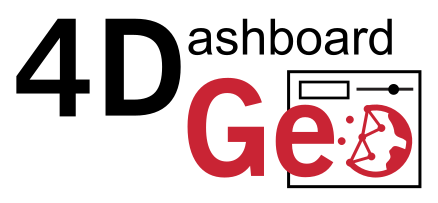

# 4DGeo

  

4DGeo is an open-source, modular, super lightweight, web-based interactive dashboard application for visualizing your point cloud timeseries captured with a continuous and even ongoing 3D environmental monitoring station (e.g. LiDAR, 3D photogrammetry, smartphone). 

You can access a hosted version of the dashboard [here](https://3dgeo-heidelberg.github.io/4DGeo/).

## Get started in 2 minutes: Visualize your point clouds

To show how easy it is to visualize your data with a 4DGeo dashboard, we've prepared a short [Python Notebook](https://3dgeo-heidelberg.github.io/4DGeo/docs/getting_started.html) tutorial. It demonstrates how a series of point clouds can be projected into images and displayed within the dashboard.

The process involves just two simple steps:

- **Prepare your data:** Convert your list of images into the 4DGeo [data model](https://3dgeo-heidelberg.github.io/4DGeo/docs/Application.html#21-data-model). This is what's done in the above mentioned [Python Notebook](https://3dgeo-heidelberg.github.io/4DGeo/docs/getting_started.html).
- **Configure your dashboard:** Either load a predefined layout or create your own with our [dashboard creation page](https://3dgeo-heidelberg.github.io/4DGeo/docs/Application.html#21-data-model)

##  Online documentation

Thorough online documentation on the dashboard can be found [here](https://3dgeo-heidelberg.github.io/4DGeo/docs). Feel free to use the notebook implementation examples as a starting point, and remember to cite this repository.

## Contributing

Contributions are welcome! If you have suggestions or feature requests, feel free to open an [issue](https://github.com/3dgeo-heidelberg/4DGeo/issues). For your own implementations, you can also fork this repository.
