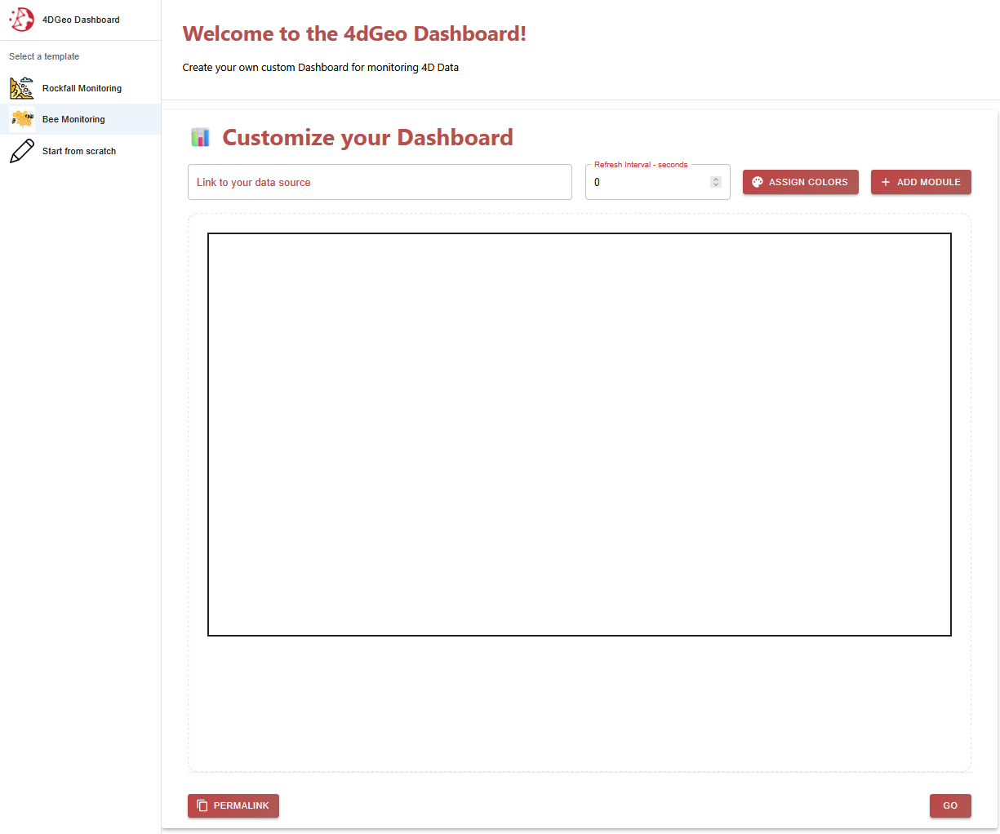
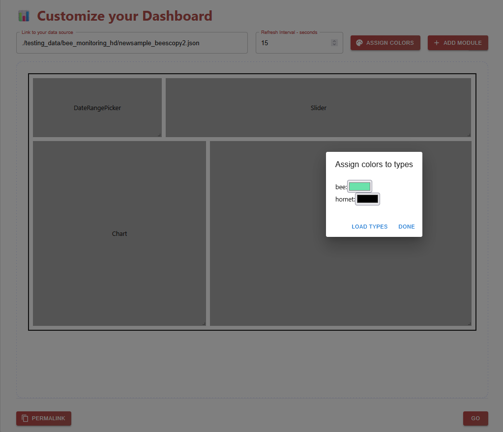
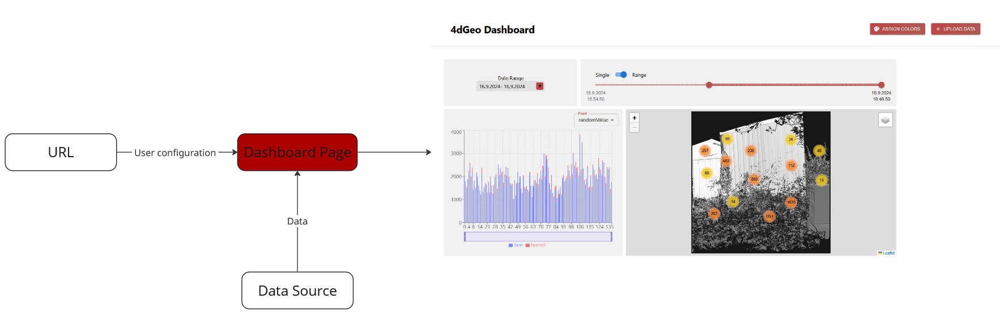
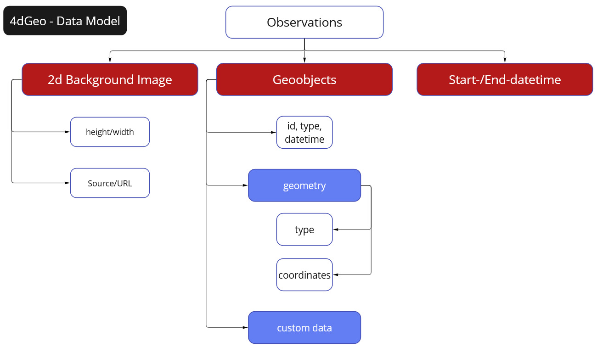
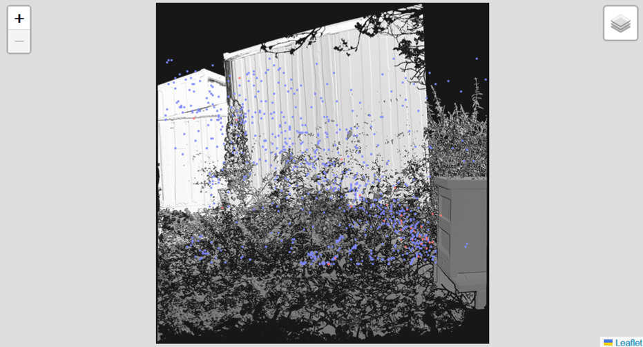
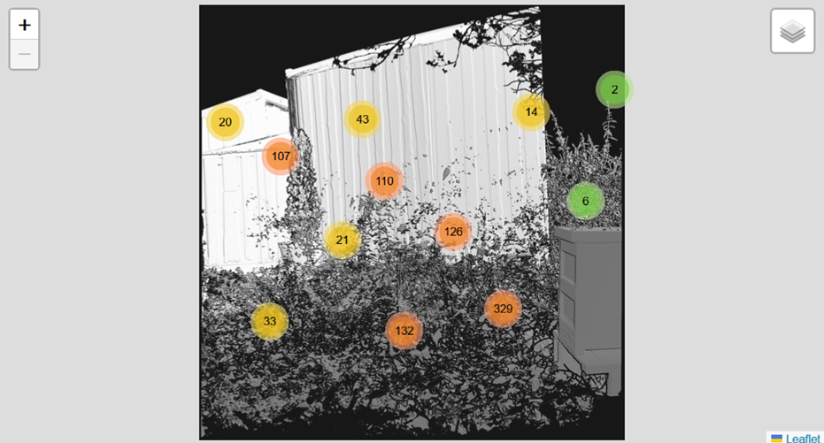
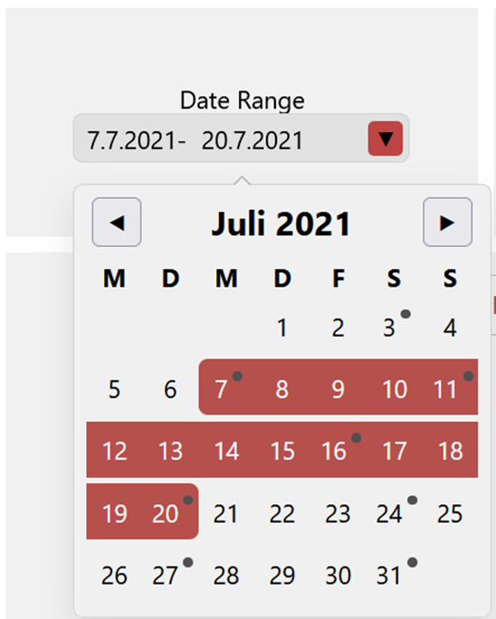
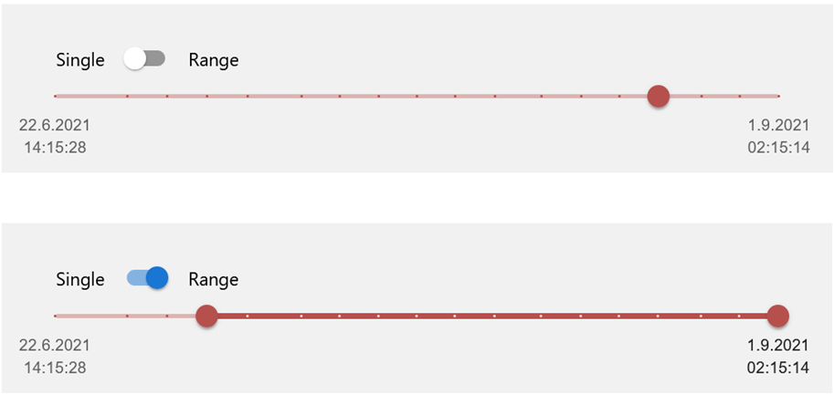

# 4DGeo Application

For better understanding and easier usage of the 4DGeo Dashboard, its functionalities, structure and concepts will be explained here. The Application is split into two parts: the dashboard creation page and the dashboard view page.

## 1 Creation Page
On the dashboard creation page, you can design your own dashboard with a custom layout including all the modules you want to add, the data source, refresh interval and color assignment.



### 1.1 Data Source
The data source is an integral part of the design of a dashboard. It defines the location of the data that should be read. This has to be a concrete link or URL to a specific file in the correct [format](#datamodel).

### 1.2 Refresh Interval
You have the option to specify the frequency of refreshes for the dashboard. At every refresh, the data from your given data source is read and checked for updates. For example if you have a new analysed scan that you want to include into the dashboard, you just have to update the file in your data source and the dashboard will automatically show this new content on the next refresh.

### 1.3 Color Assignment
The Color Assignment feature helps create a more appealing and customized visualisation. It works as a map between all the possible types of geoobjects in your data and their respective assigned color, that you can freely choose once loaded. This feature only works when you already specified your data source link because it first reads a snapshot of the data and filters every present type to create the user input. 

If you dont use this option when creating a dashboard, a random color assignment will be generated.



### 1.4 Layout
The layout of a dashboard is defined as a map of each instance of a module and their position and size in the dashboard. This map approach makes it possible to save this layout information for example as a simple json string.

### 1.5 Permalinks
Once you have designed your dashboard and configured all the wanted options, you want to see the dashboard in action. But for that, all of your configurations have to be communicated to the dashboard page. For this, all of your input can be saved as a <b>permalink</b>.

A permalink hashes all the values into a base64-String. This string is appended as a variable to the URL of the dashboard page. With this approach, each dashboard design can be stored in a simple link and shared and is easily reproducable this way.

With the <b>Read from permalink</b> button, you can also read all the configurations of a design inside of the creation page and adjust it to your needs before going to the dashboard page.

### 1.6 Templates
The idea of populating the creation section with data from a permalink is expanded with a list of <b>templates</b>. A template is a predefined (example-)dashboard with sample data connected. For now, each template is defined in the `public/example_dashboards/example_dashboards.json` file as a json object with every design option predefined. In the future, this json file will be replaced with a list of permalinks because every information needed is also in there. 


## 2 Dashboard View Page
This page is the main visualisation page. A dashboard is generated via the stored information in the permalink with its layout, data source, refresh rate and color assignment. It is then populated with data automatically read from the given data source. Each module of the dashboard has its own functionality and will be further explained [later](#modules). Based on your specified refresh interval, the dashboard rereads the data from your data source and updates the content if anything changed.



The dashboard is built around our self-designed data model.

<a name="datamodel"></a>

### 2.1 Data Model
Our data model mainly serves the purpose to make the dashboard use-case independent. This way, the app can be used in a variety of scenarios that have their own data format but need to convert it into this data model.



It is designed around <b>observations</b>. An observation can be described as a snapshot of the real world over a specified area at a specific short interval in time.
<br>
For example, a use-case could be to monitor rockfalls and landslides on a mountain slope with a powerful LiDAR scanner. In this example, an observation would be a single scan of the area.

Each observation includes a <b>start</b>- and <b>end-datetime</b> (in ISO 8601 format) for specifying the exact point in time. Additionally, it contains information for a <b>2D background image</b> to represent the environment at the time of the scan. This information consists of the URL to the image file as well as its width and height in pixels. With each observation having their own respective background image, changes in the environment can be visualized.

Lastly, each observation incorporates their own list of <b>geoobjects</b>. A geoobject is a detected and analysed object at a certain location. In our rockfall monitoring example, a detected geoobject could be a single rockfall, represented as a polygon, and its area.

A geoobject includes the following attributes:

- `id` (String): Your own managed id.
- `type` (String): The type of geoobject. This is very use-case dependent and can be set as you want.
- `datetime` (String ISO 8601 format): This specifies the specific point in time inside of the interval of its observation. It has to be a string in ISO 8601 format.
- `geometry`: In order to visualise a geoobject, they need to specify their geometry. This is comparable to the geometry object in the [GeoJSON definition](https://datatracker.ietf.org/doc/html/rfc7946#page-7)
    - `type` (String): The type of geometry. Inspired by the GeoJSON [geometry type](https://datatracker.ietf.org/doc/html/rfc7946#section-1.4). As of now, Polygons, Points and LineStrings are supported.
    - `coordinates` (Array): The exact coordinates of a geoobject. The structure of the values are based on the defined geometry type. These coordinates serve to correctly locate the position of the geoobjects in the 2D Viewer Module. The geoobjects will be visualised in front of the background image. The coordinates thus have to be in pixel values with [0, 0] being in the top-left hand corner and [-imageHeight, imageWidth] being in the bottom-right hand corner.
- `customAttributes` (Dictionary key-value): These custom attributes cover your use-case dependent information. They represent additional information bound to a specific geoobject. These attributes are the basis for the Chart Module. In our rockfall example, the custom attributes could include data like the rockfall magnitude or total volume.


This is a skeleton overview of how the finished data should look like:
```json
{
    "observations": [
        {
            "startDateTime": "String in ISO 8601 format",
            "endDateTime": "String in ISO 8601 format",
            "backgroundImageData": {
                "url": "",
                "height": 0,
                "width": 0
            },
            "geoObjects": [
                {
                    "id": "",
                    "type": "",
                    "dateTime": "String in ISO 8601 format",
                    "geometry": {
                        "type": "GeoJSON geometry type",
                        "coordinates": [
                            [1, 1, 1],
                            [1, 2, 1]
                        ]
                    },
                    "customAttributes": {
                        "customKey": "",
                        "customKey2": ""
                    }
                }
            ]
        },
        {
            ...
        }
    ]
}
```

<a name="modules"></a>

## 3 Modules

### 3.1 Visualisation Modules
With these modules, your data will be visualised in different ways so that you can analyse them to your liking.

#### 2D View Map
In the 2D View, all the geoobjects inside of your data will be rendered with a leaflet map infront of the specified background image. When multiple observations are selected, the background image is taken from the first. For now, only Polygons, Points and LineStrings are supported. <br>
There are 2 layers you can choose from: 

- Normal Layer: All the filtered geoobjects will be shown as their original geometry
- Clustered Laye: For a better performance, objects that are near each other can be automatically grouped into a cluster that will be shown as a point indicating the number of objects inside it. In this layer, polygons that are very small on your current zoom level will also be deflated into markers for better visibility.






#### Chart Visualisations
Additionally to the 2D View Module, this module can visualise the custom attributes of your objects.

For now, only the bar chart is implemented.<br>
Here, all your selected observations are shown as a bar. The value of this bar is calculated with the chosen operator and field. The field has to be a number value to be calculated correctly. Each bar is divided into all available geoobject types for a more detailed view. For operators, the following are included:

- Add: All values of the chosen attribute are summed up.
- Average: The average value of the chosen attribute.
- Min: Only the smallest value of the attribute will be shown.
- Max: Only the biggest value of the attribute will be shown.
- Count: The total count of objects. If a field is selected, the only objects that have the chosen field are counted.


### 3.2 User Input
Next to the visualisation modules, user input modules are important to guarantee a responsive dashboard. They support functionality to filter your observations with time-based selection options.

#### Date Range Calendar
With this module, you can choose a date range so that only observations that fall into this time-interval will be shown. Inside of the calendar, all days where an observation took place are marked with a small dot for better navigation. For this, only the start datetime of each observation is used.



#### Observation Slider
Other than the date range module that takes care of a broad selection, the observation slider lets you define a more detailed selection. All the observations that fall into your chosen date range are shown on the slider. You have the option to then choose between the <i>Single</i> and <i>Range</i> mode:

- Single: Only one observation is selected at a time.
- Range: You can specify a start- and end-observation.



## 4 Other Functionality

### 4.1 Color Assignment
On the dashboard page, you can also freely adjust the colors of each type of geoobject with the "Assign Colors" button.

### 4.2 File Upload
If you have a file that you quickly want to visualise with the dashboard, instead of setting up and uploading to a server, you can temporarily upload the file into the dashboard directly. This file is not saved and will be lost on refresh or if you share the permalink.

### 4.3 Export by Map Extent
With this button, you can download a subset of you data. Only geoobjects that you selected and that are currently visible in the 2D View Map will be exported in the correct data format of the dashboard.


## 5 Project Structure
This project is organized into several main directories and files, each serving a specific purpose:

- /src: Contains the main source code for the application
    - /components: The React components, including the different dashboard modules.
    - /fourdgeo: Python backend utilities and functions needed for the example notebooks.
    - /pages: The 2 pages of the application.
    - /styles: Includes the main theme of the dashboard.
    - /utils: Utility functions for the dashboard like the http fetcher.
- /public: Contains different public files for the dashboard for simple customization of the dashboard.


## 6 Example Dataflows
You can look at a few tutorials and example dataflows in the Example Notebook section of this documentation to make your own data compatible with the dashboard